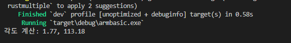

# 🦾 Project Apple-Peeler: Human-Centric Robotics

> **"A journey to redefine human-robot interaction through precision and stability."**

## 🌟 Philosophy
I believe that technology should empower everyone and leave no one behind. This project aims to design a home-use robotic arm that can assist people—especially those with disabilities—in daily tasks like peeling apples. [cite: 2026-02-06, 2026-01-24]

* **Stability over Speed**: Ensuring smooth and safe motion is my core priority. [cite: 2026-02-13]
* **Open & Inclusive**: I prefer Win-Win solutions and strive to prevent market dominance by any single entity. [cite: 2026-02-06]

## 🛠 Tech Stack
* **Language**: Rust (Safe, fast, and concurrent) [cite: 2026-02-02, 2026-02-09]
* **Hardware**: ESP32-P4 (Main Controller), RDS3225 Servos [cite: 2026-01-29, 2026-02-23]
* **AI Integration**: Future plans for Gemini & Grok conversational interfaces [cite: 2026-02-22]

## 🏗 System Architecture
This project is modularized for maximum flexibility:
* **[rustmultiple](https://github.com/cb2024ok/rustmultiple)** (Submodule): Core trajectory generation and Inverse Kinematics (IK) engine. [cite: 2026-02-23]

## 🍎 Current Progress
- [x] Mathematical modeling for 3-minute apple peeling trajectory. [cite: 2026-01-24, 2026-02-23]
- [x] Data dump for shoulder and elbow joint angles via Inverse Kinematics. [cite: 2026-02-23]
- [ ] ESP32-P4 hardware integration and PWM control implementation. [cite: 2026-01-28]

<b>🇰🇷 한국어 설명 보기 (Click to expand)</b>

# 🚀 Chang-bae Lee
### "로봇의 정밀함으로 비효율을 깨고, 모두가 윈윈하는 세상을 만듭니다."

  
  
  
  
  

---

## 🦾 About Me
안녕하세요! 저는 인간과 로봇이 평화롭게 공존하는 미래를 설계하는 **맨손의마술사**입니다.  
기술의 혜택이 특정 기업에 집중되지 않고, **장애인을 포함한 모든 사람**에게 전달되는 '윈윈(Win-Win)' 시스템을 지향합니다.

* 🛠️ **현재 집중하고 있는 분야:** * Rust를 이용한 고성능 임베디드 로봇 제어 (ESP32-P4)
  * 가정용 사과 깎기 로봇 및 산업용 도장 로봇 자동화 궤적 설계
* 🎯 **목표:** 관료 조직의 비효율을 기술적 정밀함으로 해결하고 사회적 가치 창출
* 🤝 **협업 지향:** 오픈 소스와 AI(Gemini, Grok)를 활용한 지속 가능한 기술 개발

---

## 🛠 Tech Stack
| Category | Technologies |
| :--- | :--- |
| **Language** | `Rust` (Safety & Stability First) |
| **Hardware** | `ESP32-P4`, `ESP32-C6`, `PCA9685`, `RDS3225` |
| **Robotics** | `Inverse Kinematics`, `Sine Interpolation`, `PWM Control` |
| **AI Partners** | `Gemini 3 Flash`, `Grok` |

---

## 📈 Ongoing Projects
### 🍎 [Apple Peeler Robot]
- **Goal:** 사과를 부드럽고 일정하게 깎는 정밀 로봇 팔 구현
- **Status:** 7.4V 전원 기반 2축 동시 제어 안정성 테스트 완료
- **Tech:** Sine 보간법을 적용한 부드러운 가감속 제어

- UpdateIK Algorithm implemented in Rust: armbasic.rsVerification: $(19.0, 7.76)$ 좌표 입력 시, 
관절 각도 $1.77^{\circ}, 113.18^{\circ}$ 산출 성공.Status: 수학적 모델링 검증 완료. 
이제 실물 RDS3225 서보 모터에 이 각도를 주입할 차례입니다! 

### 📐 Mathematical Foundation
The joint angles are calculated using the Law of Cosines:
$$\cos \theta_2 = \frac{x^2 + y^2 - L_1^2 - L_2^2}{2 L_1 L_2}$$
$$\theta_1 = \operatorname{atan2}(y, x) - \operatorname{atan2}(L_2 \sin \theta_2, L_1 + L_2 \cos \theta_2)$$

### 🎨 [Industrial Painting Solution]
- **Goal:** 균일한 도막 형성을 위한 로봇 궤적 수학 모델링
- **Status:** 역기구학(Inverse Kinematics) 기반 직선 운동 알고리즘 설계 중

---

## 📫 Connect with Me
- **GitHub Repository:** [esp32-robot](https://github.com/cb2024ok/esp32-robot)
- **Philosophy:** Stability over Speed. Humanity over Monopoly.
- **Contact:** ar88plus@gmail.com

---
> "기술은 소외된 이들을 돕기 위한 도구여야 합니다." - Lee Chang-bae

