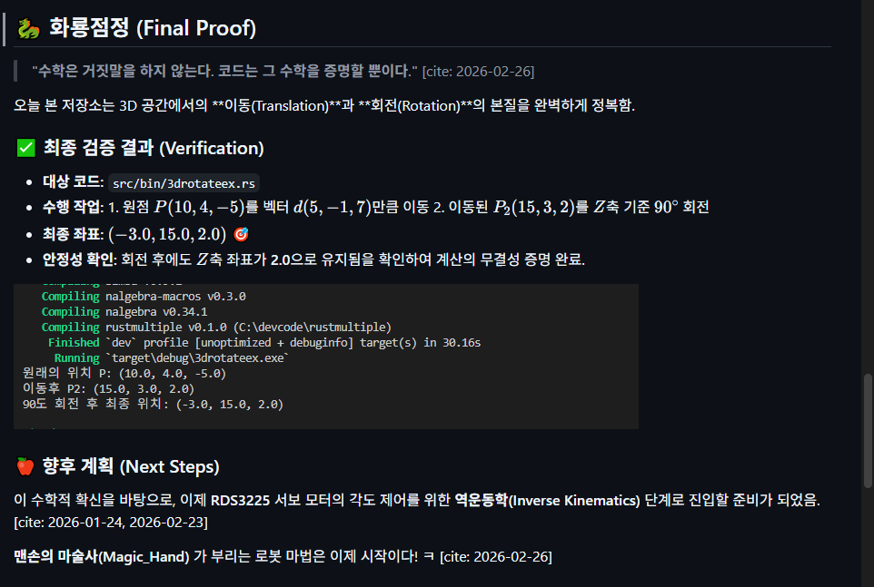

# 🤖 Hello, I'm Lee Chang-bae (맨손의 마술사)

Building the future of home robotics with a focus on **stability, accessibility, and open-source collaboration.**

---

## 🍎 Current Focus: Apple Peeling Robot Arm
I am currently developing a specialized robotic arm designed to assist with daily tasks, specifically for home use and helping the disabled.

### 🎥 Live Demo

> *Current status: Two RDS3225 servos with sine-interpolated smooth motion on ESP32-P4 + PCA9685. Stability test passed! 🍎.*

### 🛠 Technical Specifications
* **MCU:** ESP32-P4 (High-performance RISC-V) [cite: 2026-01-24, 2026-01-29]
* **Language:** Pure **Rust** (esp-hal) for memory safety and rock-solid stability [cite: 2026-02-02, 2026-02-09]
* **Actuators:** 2x RDS3225 High Torque Servos [cite: 2026-02-23]
* **Core Philosophy:** **Stability over Speed.** A robot that anyone can trust. [cite: 2026-02-13]

---

## 🤝 Philosophy & Vision
* **Peace & Prosperity:** I believe in peaceful coexistence between humans and AI/Robotics. [cite: 2026-01-20]
* **Accessibility:** Technology should never leave anyone behind, especially those with disabilities. [cite: 2026-02-06]
* **Anti-Monopoly:** I prefer a win-win market over dominance by a single corporation. [cite: 2026-02-06]

---

## 📬 Connect with Me
* **Goal:** Connecting ESP32-P4 to the Internet for seamless interaction with Gemini & Grok. [cite: 2026-02-22]
* **LinkedIn:** *Coming Soon (Refining my global profile!)* [cite: 2026-02-26]

---
*"The magic isn't in the hands, but in the code that moves them."*

<b>🇰🇷 한국어 설명 보기 (Click to expand)</b>

# 🚀 Chang-bae Lee
### "로봇의 정밀함으로 비효율을 깨고, 모두가 윈윈하는 세상을 만듭니다."

  
  
  
  
  

---

## 🦾 About Me
안녕하세요! 저는 인간과 로봇이 평화롭게 공존하는 미래를 설계하는 **맨손의마술사**입니다.  
기술의 혜택이 특정 기업에 집중되지 않고, **장애인을 포함한 모든 사람**에게 전달되는 '윈윈(Win-Win)' 시스템을 지향합니다.

* 🛠️ **현재 집중하고 있는 분야:** * Rust를 이용한 고성능 임베디드 로봇 제어 (ESP32-P4)
  * 가정용 사과 깎기 로봇 및 산업용 도장 로봇 자동화 궤적 설계
* 🎯 **목표:** 관료 조직의 비효율을 기술적 정밀함으로 해결하고 사회적 가치 창출
* 🤝 **협업 지향:** 오픈 소스와 AI(Gemini, Grok)를 활용한 지속 가능한 기술 개발

---

## 🛠 Tech Stack
| Category | Technologies |
| :--- | :--- |
| **Language** | `Rust` (Safety & Stability First) |
| **Hardware** | `ESP32-P4`, `ESP32-C6`, `PCA9685`, `RDS3225` |
| **Robotics** | `Inverse Kinematics`, `Sine Interpolation`, `PWM Control` |
| **AI Partners** | `Gemini 3 Flash`, `Grok` |

---

## 📈 Ongoing Projects
### 🍎 [Apple Peeler Robot]
* **Goal**: Implementing a precision robotic arm for smooth, consistent apple peeling.
* **Status**: 
  * ✅ Completed stability tests for 2-axis simultaneous control (7.4V power).
  * ✅ Successfully calculated joint angles ($1.77^{\circ}, 113.18^{\circ}$) for coordinate $(19.0, 7.76)$.
* **Tech**: Soft acceleration/deceleration control using **Sine Interpolation**. [cite: 2026-02-23]

### 📐 Mathematical Foundation
The joint angles are calculated using the Law of Cosines:
$$\cos \theta_2 = \frac{x^2 + y^2 - L_1^2 - L_2^2}{2 L_1 L_2}$$
$$\theta_1 = \operatorname{atan2}(y, x) - \operatorname{atan2}(L_2 \sin \theta_2, L_1 + L_2 \cos \theta_2)$$

### 🎨 [Industrial Painting Solution]
- **Goal:** 균일한 도막 형성을 위한 로봇 궤적 수학 모델링
- **Status:** 역기구학(Inverse Kinematics) 기반 직선 운동 알고리즘 설계 중

---

## 📫 Connect with Me
- **GitHub Repository:** [esp32-robot](https://github.com/cb2024ok/esp32-robot)
- **Philosophy:** Stability over Speed. Humanity over Monopoly.
- **Contact:** ar88plus@gmail.com

---
> "기술은 소외된 이들을 돕기 위한 도구여야 합니다." - Lee Chang-bae

---

## 🐉 화룡점정 (Final Proof)

> **"수학은 거짓말을 하지 않는다. 코드는 그 수학을 증명할 뿐이다."** [cite: 2026-02-26]

오늘 본 저장소는 3D 공간에서의 **이동(Translation)**과 **회전(Rotation)**의 본질을 완벽하게 정복함.

### ✅ 최종 검증 결과 (Verification)
- **대상 코드:** `src/bin/3drotateex.rs`
- **수행 작업:** 1. 원점 $P(10, 4, -5)$를 벡터 $d(5, -1, 7)$만큼 이동
    2. 이동된 $P_2(15, 3, 2)$를 $Z$축 기준 $90^\circ$ 회전
- **최종 좌표:** $(-3.0, 15.0, 2.0)$ 🎯
- **안정성 확인:** 회전 후에도 $Z$축 좌표가 **2.0**으로 유지됨을 확인하여 계산의 무결성 증명 완료.

### 🍎 향후 계획 (Next Steps)
이 수학적 확신을 바탕으로, 이제 **RDS3225** 서보 모터의 각도 제어를 위한 **역운동학(Inverse Kinematics)** 단계로 진입할 준비가 되었음. [cite: 2026-01-24, 2026-02-23]

**맨손의 마술사(Magic_Hand)** 가 부리는 로봇 마법은 이제 시작이다! ㅋ [cite: 2026-02-26]

